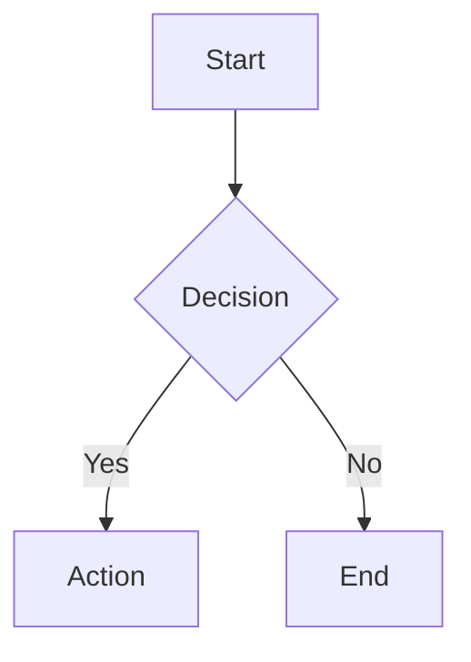

# RenderMermaid

`RenderMermaid` is an optional built-in tool that renders Mermaid source to terminal-friendly text.

## Enable it

Disabled by default. Turn it on in `/settings` under **Tools → Render Mermaid**, or in `~/.omp/agent/config.yml`:

```yaml
renderMermaid:
  enabled: true
```

## What it does

- Tool name: `render_mermaid`
- Input: Mermaid source in the required `mermaid` field
- Output: rendered ASCII/Unicode text, not SVG or PNG
- Storage: when artifact storage is available, the full render is also saved as an `artifact://...`

There are no model-specific or environment-variable prerequisites. Once enabled, any model that can call built-in tools can use it.

## Parameters

```json
{
  "mermaid": "graph TD\n  A[Start] --> B[Stop]",
  "config": {
    "useAscii": false,
    "paddingX": 2,
    "paddingY": 2,
    "boxBorderPadding": 0
  }
}
```

Available `config` fields:

- `useAscii` — `true` for plain ASCII, `false` for Unicode box-drawing characters (default and usually more readable)
- `paddingX` — horizontal spacing between nodes
- `paddingY` — vertical spacing between nodes
- `boxBorderPadding` — inner padding inside node boxes

## Current limitations

`RenderMermaid` uses the `beautiful-mermaid` ASCII renderer. It works best for flowcharts and small diagrams.

Complex sequence diagrams, especially with `alt` / `else` blocks, can become very wide in a terminal. That is current renderer behavior, not a provider or model configuration problem.

If a sequence diagram is hard to read:

1. Keep Unicode output (`useAscii: false`)
2. Reduce spacing with a tighter config such as `paddingX: 2`, `paddingY: 2`, `boxBorderPadding: 0`
3. Prefer smaller sub-diagrams over one large sequence diagram
4. Open the saved artifact if the inline preview is truncated in the TUI

## Example

Input:



Typical result:

```text
┌─────┐
│Start│
└─────┘
   │
   ▼
┌────────┐
│Decision│
└────────┘
```
