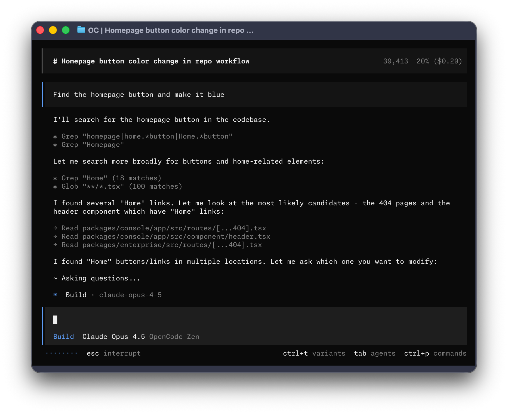

<p align="center">
  <a href="https://opencode.ai">
    <picture>
      <source srcset="packages/console/app/src/asset/logo-ornate-dark.svg" media="(prefers-color-scheme: dark)">
      <source srcset="packages/console/app/src/asset/logo-ornate-light.svg" media="(prefers-color-scheme: light)">
      
    </picture>
  </a>
</p>
<p align="center">오픈 소스 AI 코딩 에이전트.</p>
<p align="center">
  <a href="https://opencode.ai/discord"></a>
  <a href="https://www.npmjs.com/package/opencode-ai"></a>
  <a href="https://github.com/anomalyco/opencode/actions/workflows/publish.yml"></a>
</p>

<p align="center">
  <a href="README.md">English</a> |
  <a href="README.zh.md">简体中文</a> |
  <a href="README.zht.md">繁體中文</a> |
  <a href="README.ko.md">한국어</a> |
  <a href="README.de.md">Deutsch</a> |
  <a href="README.es.md">Español</a> |
  <a href="README.fr.md">Français</a> |
  <a href="README.it.md">Italiano</a> |
  <a href="README.da.md">Dansk</a> |
  <a href="README.ja.md">日本語</a> |
  <a href="README.pl.md">Polski</a> |
  <a href="README.ru.md">Русский</a> |
  <a href="README.bs.md">Bosanski</a> |
  <a href="README.ar.md">العربية</a> |
  <a href="README.no.md">Norsk</a> |
  <a href="README.br.md">Português (Brasil)</a> |
  <a href="README.th.md">ไทย</a> |
  <a href="README.tr.md">Türkçe</a> |
  <a href="README.uk.md">Українська</a> |
  <a href="README.bn.md">বাংলা</a> |
  <a href="README.gr.md">Ελληνικά</a> |
  <a href="README.vi.md">Tiếng Việt</a>
</p>

[](https://opencode.ai)

---

### 설치

```bash
# YOLO
curl -fsSL https://opencode.ai/install | bash

# 패키지 매니저
npm i -g opencode-ai@latest        # bun/pnpm/yarn 도 가능
scoop install opencode             # Windows
choco install opencode             # Windows
brew install anomalyco/tap/opencode # macOS 및 Linux (권장, 항상 최신)
brew install opencode              # macOS 및 Linux (공식 brew formula, 업데이트 빈도 낮음)
sudo pacman -S opencode            # Arch Linux (Stable)
paru -S opencode-bin               # Arch Linux (Latest from AUR)
mise use -g opencode               # 어떤 OS든
nix run nixpkgs#opencode           # 또는 github:anomalyco/opencode 로 최신 dev 브랜치
```

> [!TIP]
> 설치 전에 0.1.x 보다 오래된 버전을 제거하세요.

### 데스크톱 앱 (BETA)

OpenCode 는 데스크톱 앱으로도 제공됩니다. [releases page](https://github.com/anomalyco/opencode/releases) 에서 직접 다운로드하거나 [opencode.ai/download](https://opencode.ai/download) 를 이용하세요.

| 플랫폼                | 다운로드                           |
| --------------------- | ---------------------------------- |
| macOS (Apple Silicon) | `opencode-desktop-mac-arm64.dmg`   |
| macOS (Intel)         | `opencode-desktop-mac-x64.dmg`     |
| Windows               | `opencode-desktop-windows-x64.exe` |
| Linux                 | `.deb`, `.rpm`, 또는 AppImage      |

```bash
# macOS (Homebrew)
brew install --cask opencode-desktop
# Windows (Scoop)
scoop bucket add extras; scoop install extras/opencode-desktop
```

#### 설치 디렉터리

설치 스크립트는 설치 경로를 다음 우선순위로 결정합니다.

1. `$OPENCODE_INSTALL_DIR` - 사용자 지정 설치 디렉터리
2. `$XDG_BIN_DIR` - XDG Base Directory Specification 준수 경로
3. `$HOME/bin` - 표준 사용자 바이너리 디렉터리 (존재하거나 생성 가능할 경우)
4. `$HOME/.opencode/bin` - 기본 폴백

```bash
# 예시
OPENCODE_INSTALL_DIR=/usr/local/bin curl -fsSL https://opencode.ai/install | bash
XDG_BIN_DIR=$HOME/.local/bin curl -fsSL https://opencode.ai/install | bash
```

### Agents

OpenCode 에는 내장 에이전트 2개가 있으며 `Tab` 키로 전환할 수 있습니다.

- **build** - 기본값, 개발 작업을 위한 전체 권한 에이전트
- **plan** - 분석 및 코드 탐색을 위한 읽기 전용 에이전트
  - 기본적으로 파일 편집을 거부
  - bash 명령 실행 전에 권한을 요청
  - 낯선 코드베이스를 탐색하거나 변경을 계획할 때 적합

또한 복잡한 검색과 여러 단계 작업을 위한 **general** 서브 에이전트가 포함되어 있습니다.
내부적으로 사용되며, 메시지에서 `@general` 로 호출할 수 있습니다.

[agents](https://opencode.ai/docs/agents) 에 대해 더 알아보세요.

### 문서

OpenCode 설정에 대한 자세한 내용은 [**문서**](https://opencode.ai/docs) 를 참고하세요.

### 기여하기

OpenCode 에 기여하고 싶다면, Pull Request 를 제출하기 전에 [contributing docs](./CONTRIBUTING.md) 를 읽어주세요.

### OpenCode 기반으로 만들기

OpenCode 와 관련된 프로젝트를 진행하면서 이름에 "opencode"(예: "opencode-dashboard" 또는 "opencode-mobile") 를 포함한다면, README 에 해당 프로젝트가 OpenCode 팀이 만든 것이 아니며 어떤 방식으로도 우리와 제휴되어 있지 않다는 점을 명시해 주세요.

---

**커뮤니티에 참여하기** [Discord](https://discord.gg/opencode) | [X.com](https://x.com/opencode)
